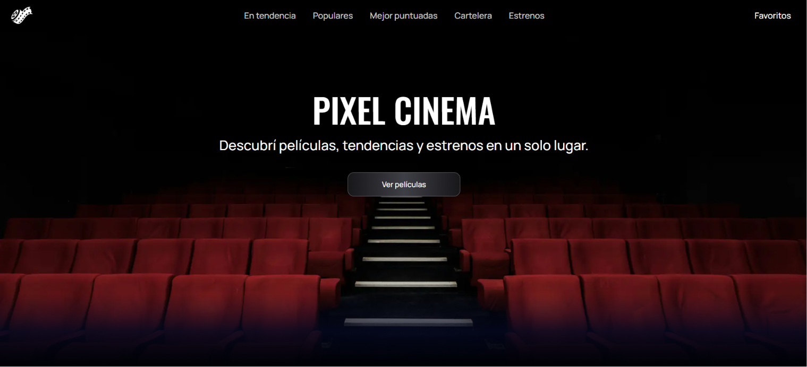
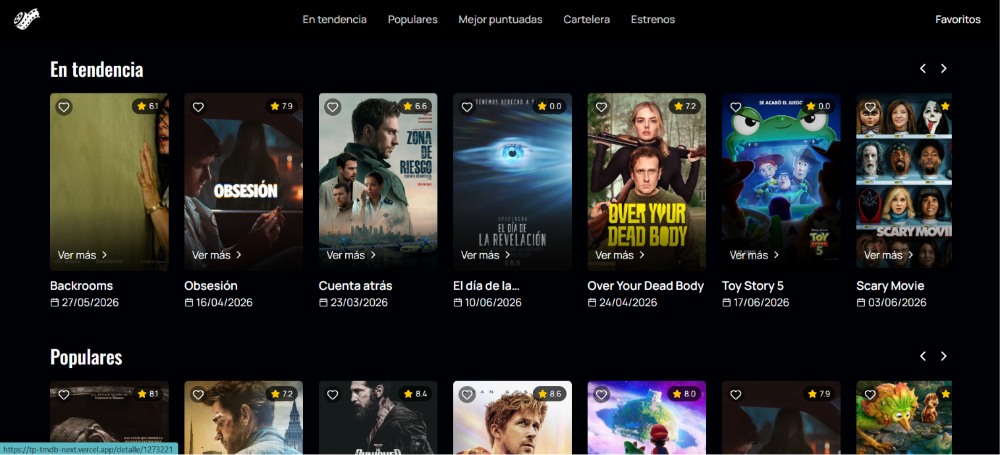
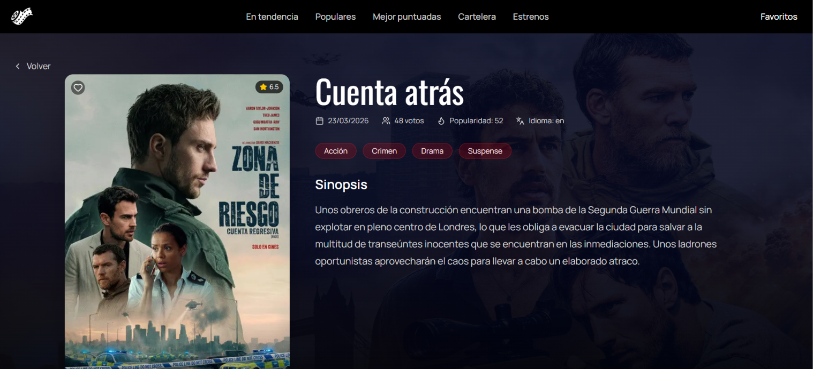
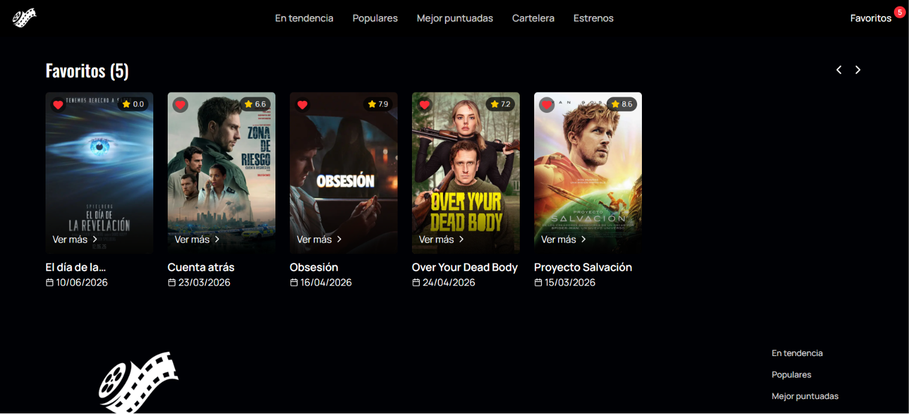

# Pixel Cinema 

## Descripción 
Aplicación web para explorar películas en tendencia, populares, mejor puntuadas y próximos estrenos, consumiendo la API de The Movie Database (TMDB). A su vez, permite ver las características de cada película en particular y seleccionar las favoritas.

## Tecnologías utilizadas
- Next.js 
- React 
- Axios 
- JavaScript 
- Tailwind CSS 
- TMDB API 

## Instrucciones de instalación 
1. Clonar el repositorio con git clone URL
2. Instalar las dependencias con npm install 
3. Crear un archivo .env.local en la raíz del proyecto con la API key de TMDB 

## Instrucciones para ejecutar el proyecto 
npm run dev 
Luego abrir http://localhost:3000 en el navegador. 

## Endpoints utilizados 
- Tendencias: /trending/movie/day
- Populares: /movie/popular 
- Mejor puntuadas: /movie/top_rated 
- En cartelera: /movie/now_playing 
- Próximos estrenos: /movie/upcoming 
- Detalle de película: /movie/{id} 

## Capturas de pantalla 

## Declaración de uso de IA 
Se utilizaron herramientas de inteligencia artificial para resolver dudas puntuales sobre sintaxis, errores que surgieron y para consultar el pase de clases css a tailwind
